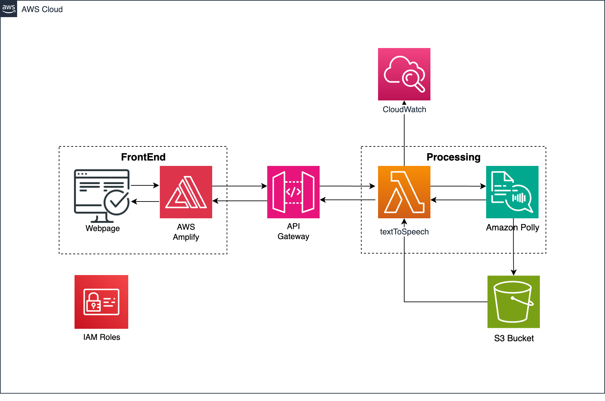
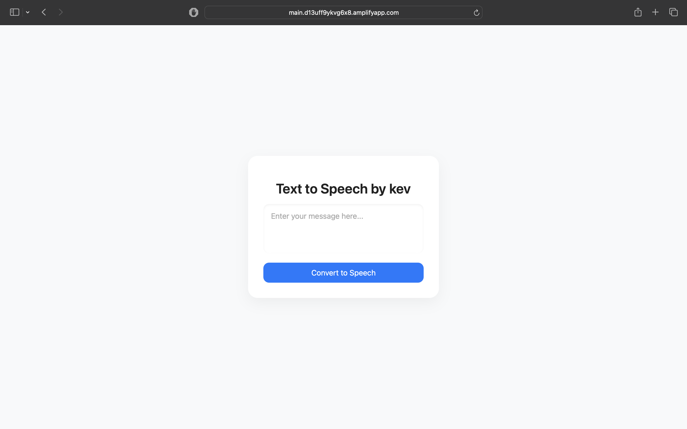
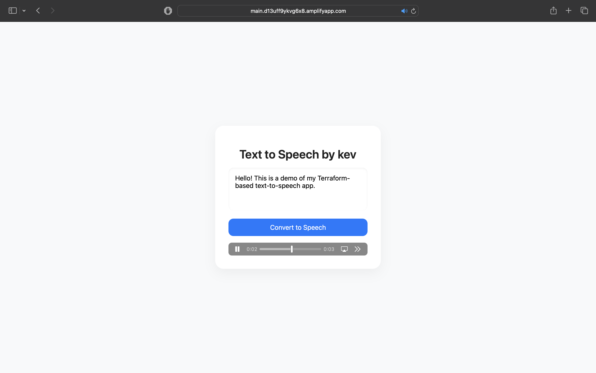
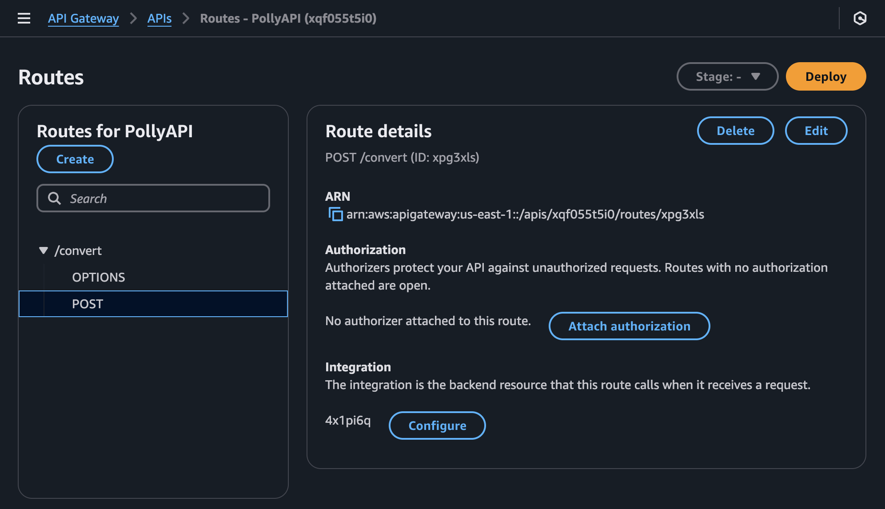
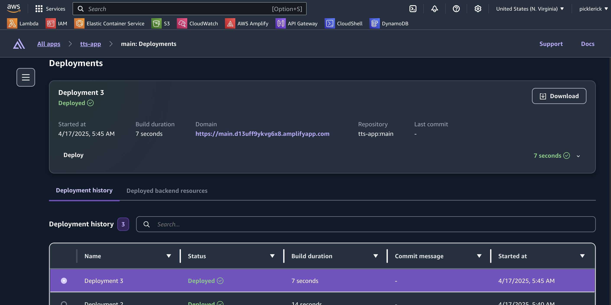
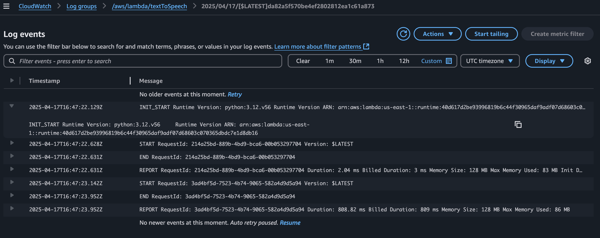
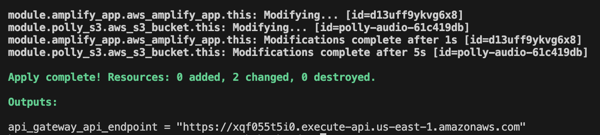
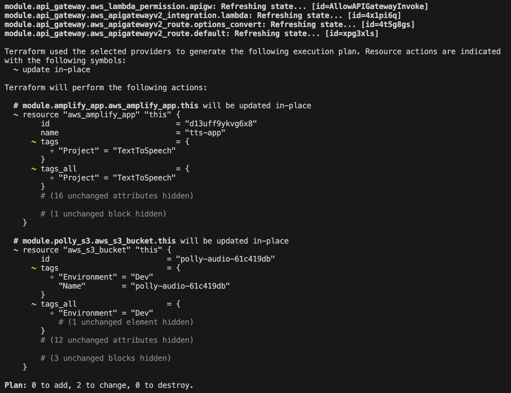

# Terraform Text-to-Speech App


A serverless, infrastructure-as-code application that converts text to speech using Amazon Polly, deployed entirely with Terraform.

This project combines the power of AWS Lambda, API Gateway, S3, and Amplify to deliver a modern, full-stack solution — all without manually touching the AWS Console.

---

## Demo
[Watch the YouTube demo](https://youtu.be/trLOUC-Cyks)

This app is currently turned off to save on AWS costs,  
but you can still see how it works in the walkthrough video above.

---

## Architecture

This diagram summarizes the full AWS-powered architecture, built and deployed using Terraform:



---

## Features

- Converts user input text into `.mp3` audio using Amazon Polly
- Uploads audio to S3 and returns a presigned URL
- Fully managed through reusable Terraform modules
- Frontend hosted with Amplify (static HTML/CSS/JS)
- CORS-safe and ready for production integrations

---

## Screenshots

**Frontend UI – Welcome Screen**  


**Frontend UI – Demo in Action**  


**API Gateway – POST /convert route setup**  


**Amplify – Deployment screen**  


**CloudWatch – Lambda logs and execution time**  


**Terraform – Output after successful apply**  


**Terraform – Execution plan with resource changes**  


---

## Tech Stack

- **Terraform (modular structure)**
- **AWS Lambda (Python 3.12)**
- **Amazon Polly (Text-to-Speech)**
- **Amazon S3 (audio file storage)**
- **API Gateway (HTTP API v2)**
- **AWS Amplify (Frontend hosting)**
- **IAM (custom roles/policies)**
- **CloudWatch (log monitoring)**

---

## Folder Structure

```text
/terraform-text-to-speech-app/
├── main.tf
├── outputs.tf
├── terraform.lock.hcl
├── modules/
│   ├── amplify/
│   ├── api_gateway/
│   ├── lambda/
│   ├── iam/
│   └── s3/
├── lambda/
│   └── polly_handler.py
├── frontend/
│   └── index.html
├── .gitignore
├── README.md
└── screenshots/
    ├── Text-To-Speech-Welcome.png
    ├── Text-To-Speech-InUse.png
    ├── API Gateway.png
    ├── AWS Amplify.png
    ├── CloudWatch Log.png
    ├── Terraform-Apply-1.png
    ├── Terraform-Apply-2.png
    └── text-to-speech-Diagram.png
```

---

## How to Deploy Your Own

### Prerequisites
- Terraform CLI installed
- AWS CLI configured (`aws configure`) or credentials loaded via environment variables

### Steps

```bash
# Clone this repo
git clone https://github.com/YOUR_USERNAME/terraform-text-to-speech-app.git
cd terraform-text-to-speech-app

# Zip your Lambda function
cd lambda
zip function.zip polly_handler.py -r
cd ..

# Deploy infrastructure
terraform init
terraform apply
```

### Manual Step (Frontend)
- Go to the Amplify Console
- Open the main branch
- Click "Manual deploy" and upload frontend.zip from the frontend/ folder

---

## About

Built by Kev

This project was a Terraform-first rebuild of my original AWS text-to-speech app — now fully modular, reproducible, and cloud-native.


## 🧠 What I Learned

This project helped me deepen my understanding of:

- Writing clean, modular **Terraform code**
- Connecting multiple **AWS services** without using the AWS Console
- Deploying real apps with **Infrastructure as Code (IaC)**
- Handling **CORS** and integrating **API Gateway with Lambda**
- Monitoring and debugging with **CloudWatch logs**
- Structuring a full-stack project for future reuse and scaling

It also pushed me to improve how I document and present my work for technical audiences.


---

## Connect with Me

📫 [LinkedIn](https://www.linkedin.com/in/franc-kevin-v-07108b111/)
